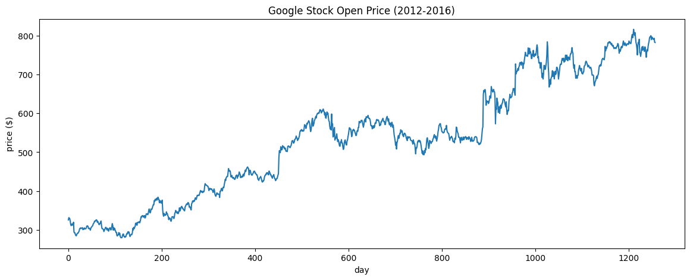
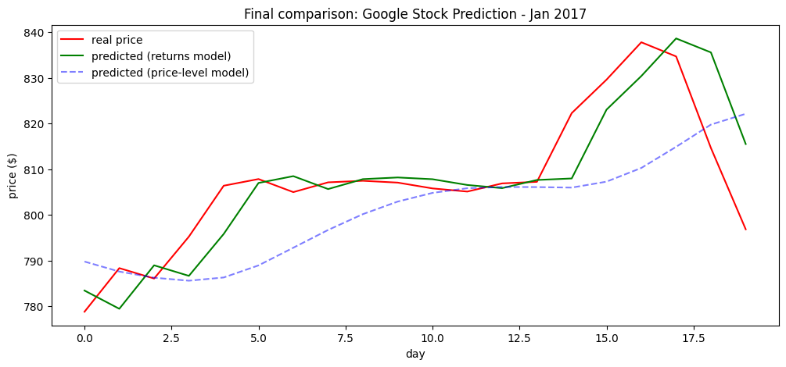

# Google Stock Price Prediction with LSTM

Predicting Google's daily stock price using an LSTM neural network — and, more importantly, figuring out *why* the obvious approach doesn't work very well, and how to fix it.


This started as a course assignment: redo the class's Apple stock LSTM notebook, but on Google stock, and try to get a better, more honestly-evaluated model. What came out of it is a small case study in why naive stock-price LSTMs are misleading, and one simple fix that actually helps.

<p align="center">
  
</p>


## The data

Daily Google (Open, High, Low, Close, Volume) prices:
- **Train:** Feb 2012 – Dec 2016 (1258 trading days)
- **Test:** Jan 2017 (20 trading days)

The CSVs are in [`data/`](data/) so the project runs standalone. (Originally sourced from a public GitHub mirror of the classic "Google Stock Price" dataset used in a lot of RNN/LSTM tutorials.)

## Approach

Two models, same architecture (3-layer LSTM, 50 units each, Dropout 0.2, EarlyStopping on validation loss), trained on 60-day sliding windows — but on two different targets:

**1. Price-level model** — predicts the scaled Open price directly. This mirrors the course notebook almost exactly.

**2. Returns-based model** — predicts the day-over-day % change instead, then reconstructs price from the previous day's *actual* price (not the model's own previous prediction, to keep the comparison fair and avoid compounding errors).

A few methodological fixes that the original course notebook skipped:
- Scaler is fit **only** on training data — no leakage from the test period.
- A proper time-ordered validation split (last 10% of windows, no shuffling) so overfitting is visible *during* training, not discovered afterward.
- A naive baseline ("tomorrow = today") to sanity-check whether the model is learning anything at all.

## Results

| Model | RMSE | MAE | R² |
|---|---|---|---|
| Price-level LSTM (course approach) | 13.94 | 10.73 | 0.106 |
| **Returns-based LSTM** | **8.43** | **5.98** | **0.673** |
| Naive baseline (tomorrow = today) | 8.59 | – | – |

The price-level model — the one that follows the course's approach — actually loses to the naive baseline. Looking at the prediction plot, it's a classic case of the model learning to just echo yesterday's price with a one-day lag, rather than learning anything real.



Switching the training target to daily returns, with the exact same architecture, drops RMSE by ~40% and pushes R² from 0.11 to 0.67 — beating the baseline this time.



The improvement over baseline is real but modest, which is expected — daily stock prices are close to a random walk, so even a small, consistent edge over "just guess yesterday's price" is a meaningful result, not a free lunch.

## Repo structure

```
.
├── Google_Stock_Price_Prediction.ipynb   # full notebook, code + outputs
├── data/
│   ├── Google_Stock_Price_Train.csv
│   └── Google_Stock_Price_Test.csv
├── images/                                # plots used in this README
├── requirements.txt
└── README.md
```

## Running it

```bash
pip install -r requirements.txt
jupyter notebook Google_Stock_Price_Prediction.ipynb
```

Or just open the notebook in Google Colab / Kaggle — no code changes needed, the data paths are relative.

## Notes / next steps

- Only `Open` price is used as input right now — adding `Volume` or `High`/`Low` as extra features is a natural next step.
- The returns-based model still isn't hugely ahead of the naive baseline. A multivariate model, or comparing against a simple ARIMA/GARCH baseline, would be a fairer test of whether the LSTM is really adding value.
